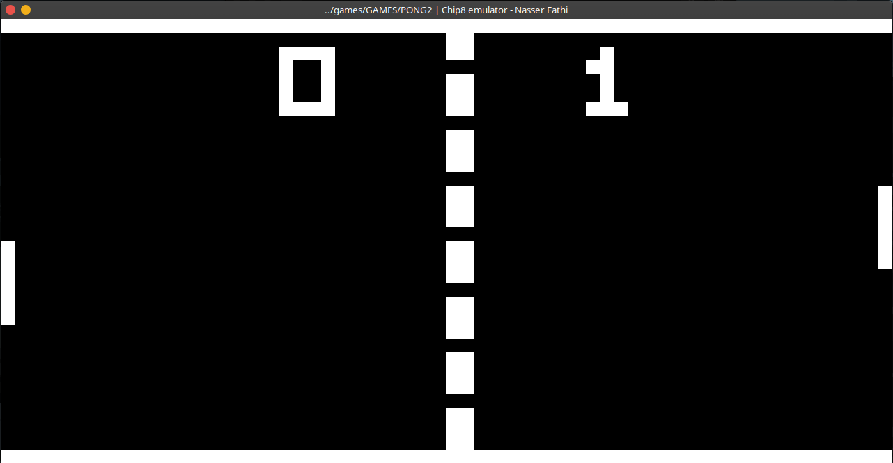
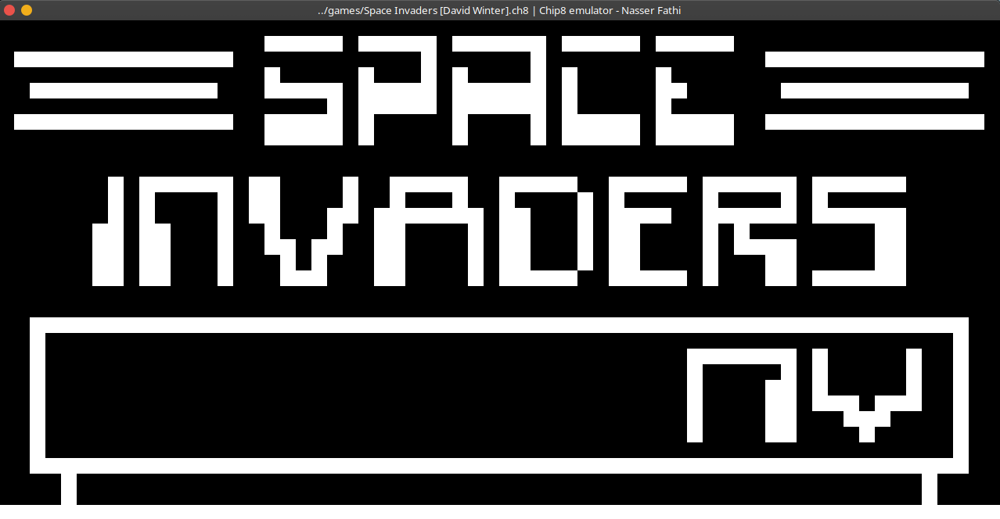

# Why you decided to make a Chip8 interpreter?

After finishing the first part of the book "[C++ Primer (5th Edition)](https://www.amazon.com/Primer-5th-Stanley-B-Lippman/dp/0321714113)", which covers the basics of C++, I decided to put everything what I've learned of that part to test. 

It was always a dream of my since middle school to make an emulator because I was fascinated how people could manage to make a program that could play for example PlayStation or Nintendo 64 games.

So I decided during that time to make a Chip8 interpreter because it was said the easiest "system" to "emulate". But unfortunately, I couldn't make dream come true because I simply lagged the general knowledge of programming and other concepts.

A decade later, I found a book on an Stack Overflow forum [topic](https://stackoverflow.com/questions/388242/the-definitive-c-book-guide-and-list) about which would be the best book to learn C++. So I decided to buy one of the recommended books. And now here we are.


## Dependencies


* [SFML](https://www.sfml-dev.org/)
* [Google Test](https://github.com/google/googletest) (only for unit testing)


## Compiling

### Chip8 interpreter

```console
$ g++ -std=c++11 -Werror -Wall -Wextra src/main.cpp -lsfml-graphics -lsfml-system -lsfml-window -lsfml-audio -o chip8
```

### Unit tests

```console
$ g++ -std=c++11 -Werror -Wall -Wextra src/test/main.cpp -lgtest -o chip8-test
```


## Usage

```bash
$ chip8 [rom-name]
```

### Pictures





## Used documentations

* [Chip-8 Technical Reference v1.0] (http://devernay.free.fr/hacks/chip8/C8TECH10.HTM)
* https://austinmorlan.com/posts/chip8_emulator/
* [How to write an emulator (CHIP-8 interpreter)](http://www.multigesture.net/articles/how-to-write-an-emulator-chip-8-interpreter/)